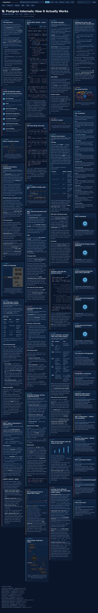
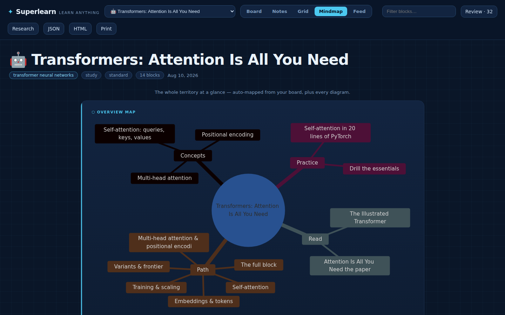
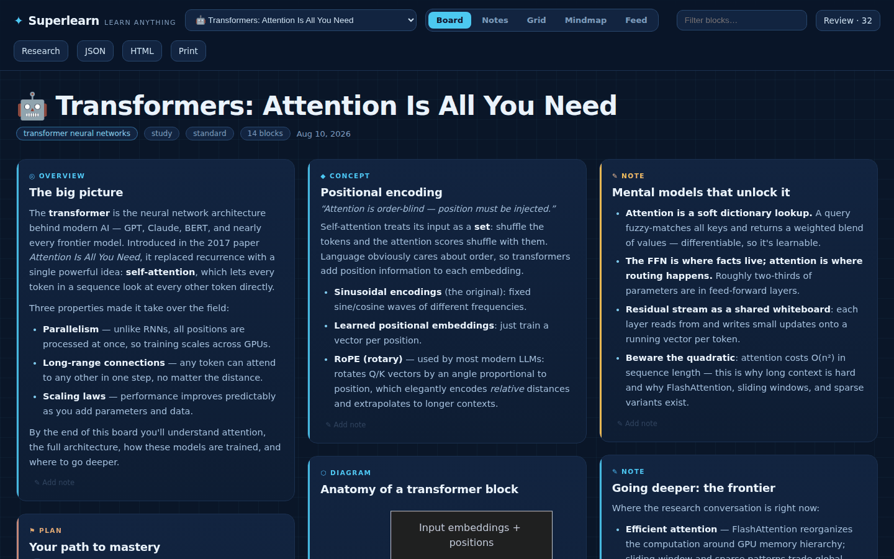
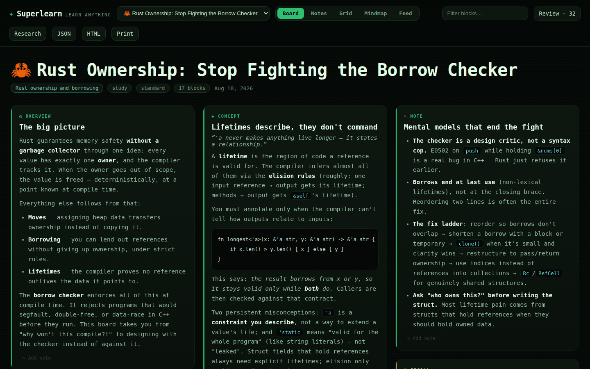
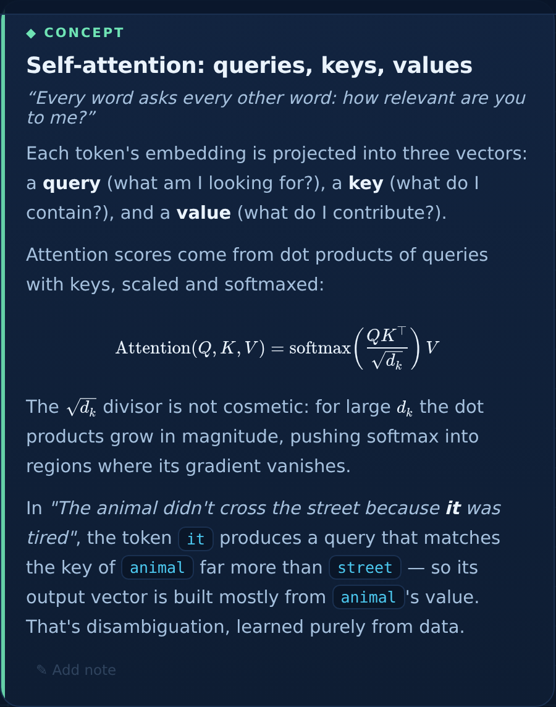
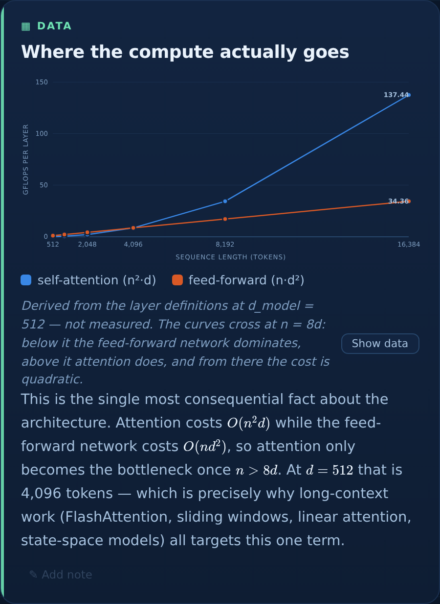
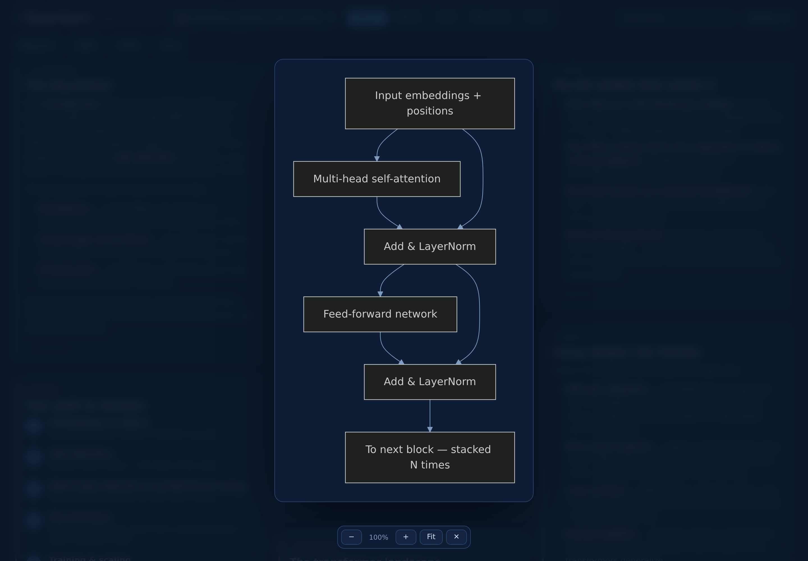
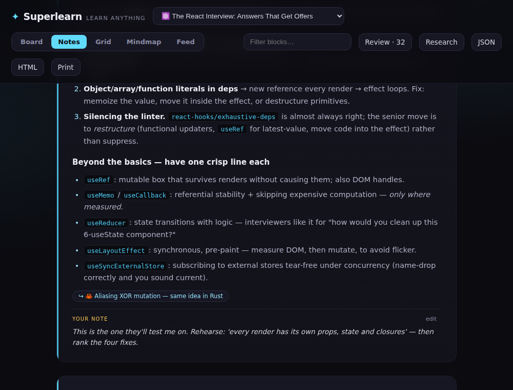
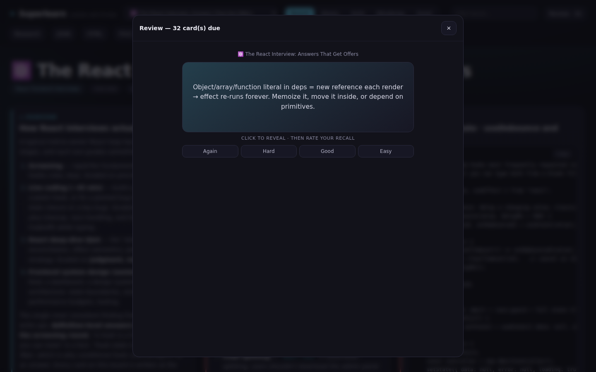
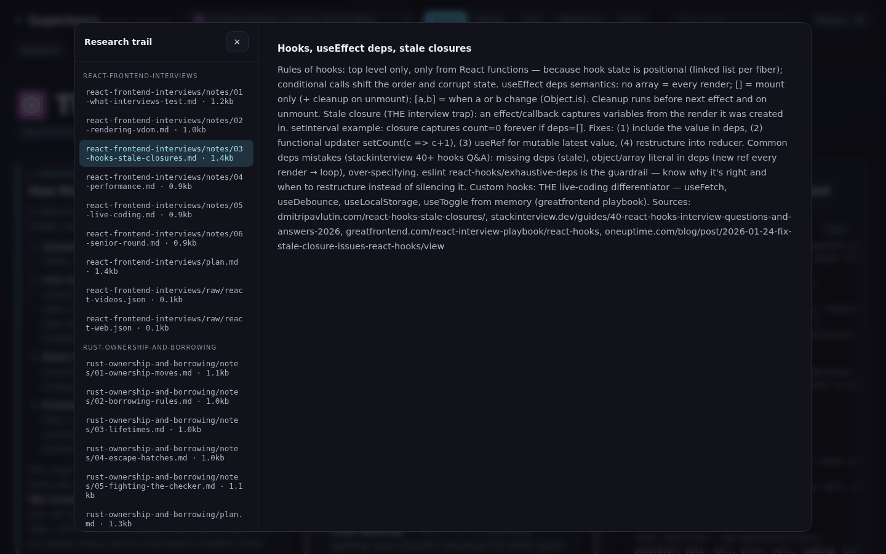

<div align="center">

# ✦ Superlearn

**Learn anything, deeply — from inside Claude Code.**

Give it a topic. It researches the live web, designs a page that fits the subject,
and serves you an interactive learning board that keeps growing as you ask for more.

*No API keys. Runs on your Claude Code subscription. Everything saved on your disk.*

</div>



---

## What it is

Superlearn is a Claude Code plugin. You type `/superlearn <topic>`; it scrapes the web, YouTube, and arXiv, runs an iterative research loop until the topic is genuinely covered, synthesizes everything into a curated learning board, and launches a local web app to study it in.

It is built for people who want **mastery**, not a summary. There are no quizzes, no streaks, no gamification — the material is research notes, concept deep-dives, diagrams and mindmaps, curated papers, working code, and learning roadmaps. Blocks are as long as the teaching requires and nothing is trimmed.

And it doesn't stop when the page loads: keep talking to the same Claude Code session — *"go deeper on X"*, *"add the original papers"*, *"make it feel more academic"* — and the page updates itself in place within seconds.

## Quick start

**Requirements:** [Claude Code](https://claude.com/claude-code) and Python 3.9+. That's it — every script is Python standard library, so there is nothing to `pip install`.

**Install from the marketplace:**

```
/plugin marketplace add raiyanyahya/superlearn
/plugin install superlearn@superlearn-marketplace
```

**Or run it from a clone:**

```bash
git clone https://github.com/raiyanyahya/superlearn
cd your-project
claude --plugin-dir /path/to/superlearn
```

**Then just ask:**

```
/superlearn transformer neural networks
/superlearn rust ownership — I already know C++
/superlearn react hooks for my frontend interview
/superlearn diffusion models, research mode
```

A few minutes later:

```
✦ Superlearn is live → http://localhost:4321
```

## How it works

```
 /superlearn <topic>
        │
        ▼
 ┌─────────────────┐  Your own files in .superlearn/sources/ (PDFs, docs) are
 │ 1. SCRAPE       │  read first, then Python scrapers sweep DuckDuckGo,
 └─────────────────┘  YouTube, and arXiv — token-free, in parallel.
        ▼
 ┌─────────────────┐  Claude writes a curriculum plan: a subtopic checklist
 │ 2. PLAN         │  sized to the topic, foundations → advanced.
 └─────────────────┘
        ▼
 ┌─────────────────┐  For every subtopic: scrape it, supplement with Claude's
 │ 3. RESEARCH ⟳   │  own web research, write dense notes, tick the box.
 └─────────────────┘  Repeat until saturated. Parallel agents on big topics.
        ▼
 ┌─────────────────┐  Claude DESIGNS the page for this subject (layout +
 │ 4. DESIGN &     │  theme), authors the board — summary, roadmap, concepts,
 │    AUTHOR       │  diagrams, code, glossary, real videos and papers —
 └─────────────────┘  then runs it through the schema validator.
        ▼
 ┌─────────────────┐  A local server hosts the app. You learn — and keep
 │ 5. SERVE        │  prompting. The page hot-reloads with new material,
 │    & ITERATE ⟳  │  badging whatever changed.
 └─────────────────┘
```

## The app

### Five layouts, switchable live

| View | What you get |
|---|---|
| **Board** | Masonry of learning cards — scan and dive |
| **Notes** | A single-column document, ordered for reading |
| **Grid** | Uniform card grid |
| **Mindmap** | An auto-generated map of the whole territory, plus every diagram |
| **Feed** | Everything, full-width, in sequence |



### Claude designs the page for the topic

Six complete visual identities — `midnight`, `blueprint`, `terminal`, `paper`, `sepia`, `arctic` — plus an optional custom accent, chosen per subject. Engineering topics arrive on a blueprint grid; systems programming in a terminal; philosophy as a sepia document. Never the same default twice out of habit.

<table>
<tr>
<td width="50%"><br><em><code>blueprint</code> — engineering & systems</em></td>
<td width="50%"><br><em><code>terminal</code> — programming & infra</em></td>
</tr>
</table>

### Built to show, not just tell

Boards render **Mermaid diagrams and mindmaps**, **real typeset math** via KaTeX (`$$\frac{QK^\top}{\sqrt{d_k}}$$`, not "Q K transpose over root d k"), **figures**, and **charts drawn from actual data** — line, bar, and scatter, with hover tooltips, a legend, and a "Show data" table for every one.

<table>
<tr>
<td width="50%"><br><em>Real TeX, inline and display</em></td>
<td width="50%"><br><em>Charts from real numbers, with a table view</em></td>
</tr>
</table>

The chart palette isn't chosen by eye. It's six hues validated with a colorblindness checker against all six theme surfaces — lightness band, chroma floor, adjacent-pair CVD separation, contrast — with a separate set of steps for light themes rather than an automatic flip. Series count is capped where the colors stop being reliably distinguishable, and the app says so instead of quietly cycling hues.

Every diagram and figure is **click-to-zoom**: full-screen, wheel to scale, drag to pan, Escape to leave. Detail is worth putting in.



### Your notes live in the board

Annotate any card in your own words. Notes save **into the board JSON**, survive exports and shares, and Claude reads them on the next iteration — write *"still don't get this"* and ask for a rewrite, and it knows exactly what you meant.



### Real spaced repetition

Flashcards are scheduled with SM-2 (Again / Hard / Good / Easy, growing intervals per card). The **Review** button runs everything due **across all your boards** in one session, with a live due count. One click exports any deck as TSV for Anki.



### The full research trail, kept

Every plan, note, and raw scraper dump is saved and browsable in the app — so you can always audit where a claim came from.



### Plus

- **"Updated" badges** on cards Claude changed since your last visit
- **Cross-board links** — related concepts jump between boards and highlight the target card
- **Click-to-play video lectures**, code blocks with copy buttons
- **Full-text filtering**, JSON export, print/PDF
- **Standalone HTML export** — one file that opens anywhere; `--offline` bakes in the diagram and math engines and the board's figures too, so it works on a plane

## Modes

`study` is the default. Ask for another in plain words (*"for my interview"*, *"survey the literature"*, *"as a reference"*) or with `--mode`. The mode changes **what gets researched** and **how the page presents it** — not just the wording.

| Mode | What changes |
|---|---|
| `study` | Balanced conceptual mastery — the default experience |
| `interview` | Likely questions with strong answers, what interviewers listen for, red flags, live-coding katas, fast-scan layout |
| `research` | Literature map: seminal + recent papers with why-each-matters, state of the field, open problems, reading order |
| `documentation` | A working reference: code-first usage patterns, configuration tables, gotchas, exact terminology |

## Everything is saved on your disk

```
.superlearn/
├── sources/     ← drop your own PDFs, papers, and docs here; they're read first
├── research/    the full trail per topic — plan, synthesized notes, raw scraper output
├── boards/      portable board JSON — share with anyone who has the plugin
└── exports/     standalone single-file HTML — opens anywhere, offline, no server
```

Nothing leaves your machine except the research requests themselves. Boards are plain JSON you can read, diff, and version-control.

## Keep iterating

The session stays live. While the server runs, keep talking to Claude Code:

- *"Add a section on error correction"*
- *"Go deeper on decoherence — include the original papers"*
- *"Make it feel more academic"* (theme and layout change, live)
- *"Build me a second board on quantum hardware"* — boards accumulate and cross-link

The page picks up each change within seconds and marks what's new.

## Scripts

Every script is standalone, stdlib-only, and usable on its own.

| Script | What it does |
|---|---|
| `scrape_web.py` | DuckDuckGo search + readable article extraction (two independent endpoints for resilience) |
| `scrape_youtube.py` | Real video IDs, titles, channels, durations |
| `scrape_arxiv.py` | Papers via the official arXiv API — abstracts, authors, PDF links |
| `validate_board.py` | Schema, theme/mode values, video-ID format, URL validity, chart data shape, Mermaid hygiene |
| `export_html.py` | Bakes a board into one self-contained HTML file (`--offline` inlines Mermaid, KaTeX and figures) |
| `serve.py` | Local app server + boards/research API |
| `publish.py` | Pushes your exported boards to a `gh-pages` branch with a generated index |

Serve existing boards any time without re-researching:

```bash
python3 scripts/serve.py --boards-dir .superlearn/boards --port 4321
```

## Board format

Boards are plain JSON: `title`, `emoji`, `topic`, `mode`, `theme` (preset + optional accent), `layout`, `sources`, and an array of typed blocks — `summary`, `roadmap`, `concept`, `note`, `diagram` (Mermaid), `chart`, `image`, `code`, `video`, `resource`, `flashcards`, `glossary`. Markdown fields render TeX. Any block may carry your `annotation` and `related` cross-board links.

The full schema and the rules Claude follows live in [`skills/superlearn/SKILL.md`](skills/superlearn/SKILL.md). Validate any board with `python3 scripts/validate_board.py <board.json>`.

## Repository layout

```
.claude-plugin/    plugin + marketplace manifests
commands/          the /superlearn slash command
skills/superlearn/ the research → design → author → serve → iterate playbook
agents/            parallel subtopic researcher
scripts/           scrapers, validator, exporter, server, publisher
app/               the Superlearn web app (single file, zero build step)
examples/          a ready-to-serve example board
```

## Notes on privacy and security

- **No API keys.** Superlearn runs on your Claude Code subscription; nothing is proxied through a third party.
- **The server is loopback-only** by default and validates the `Host` header, so a web page can't reach it via DNS rebinding. Bind wider deliberately with `--host` if you want to read boards from your phone.
- **Board content is treated as untrusted** — it's authored from scraped pages. The app escapes all rendered markdown, refuses non-`http(s)` links, and pins video embeds to validated IDs; exports neutralize the payload for HTML script context.
- **Research files are served read-only**, with path-traversal protection.

## License

MIT
